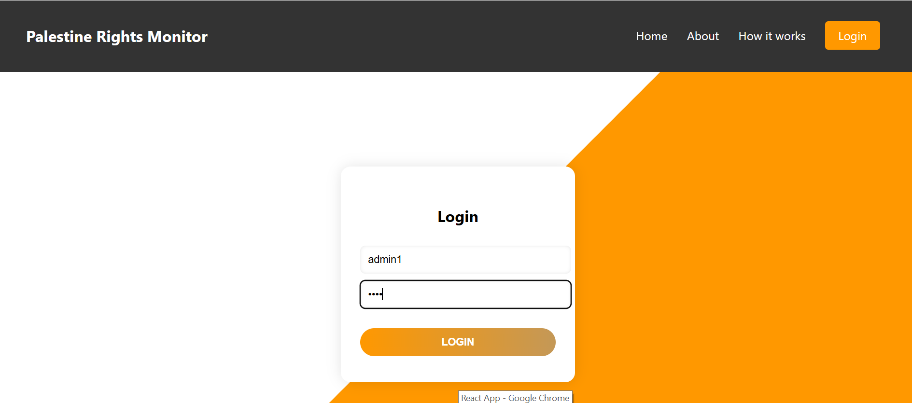
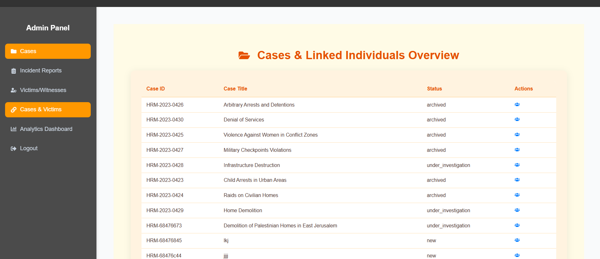
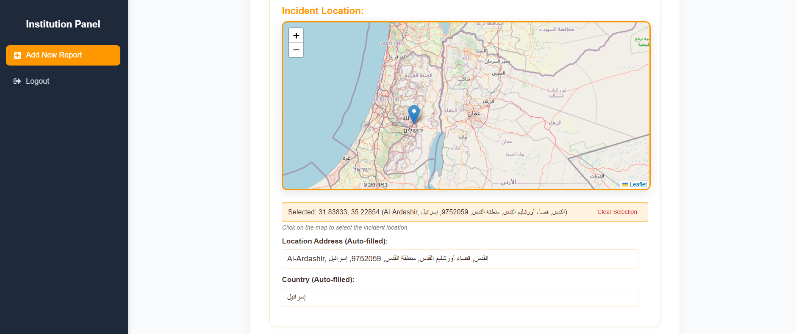
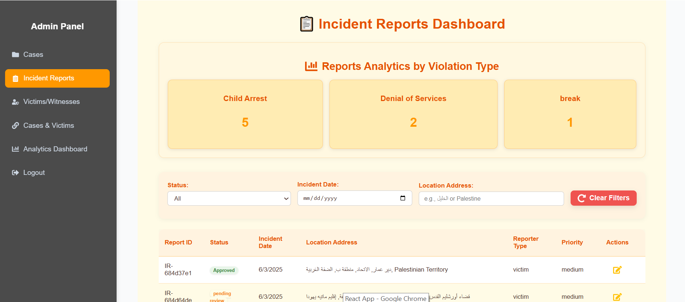
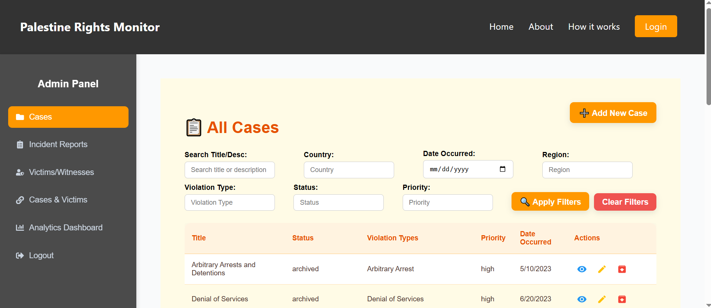
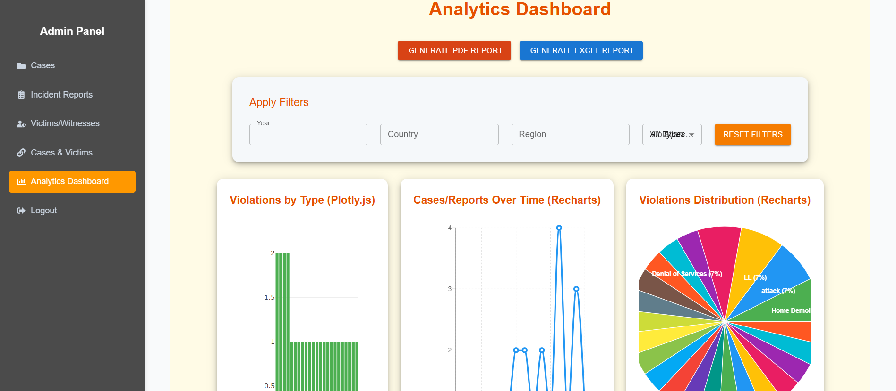
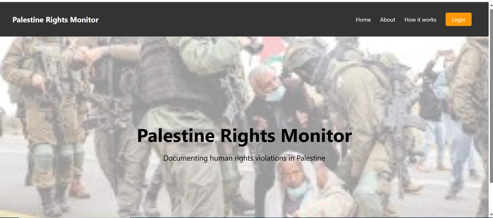

# 🛡️ Human Rights Monitor – MIS
This is a university project for the COMP4382 course . It is a system to report and track human rights violations. The system has a backend using FastAPI and a frontend built with React.

## Project Structure
- backend/: FastAPI backend with MongoDB database  
- frontend/: React frontend for the user interface  
- README.md: This file

## How to Run the Project
### ▶️ Run the Backend
➡️ cd backend ➡️ python -m venv venv ➡️ .\Scripts\activate ➡️ uvicorn main:app --reload --port 8006

### ▶️ Run the Frontend
➡️ cd frontend ➡️ npm install ➡️ npm start

The React app will run at http://localhost:3000.
It connects to the backend at http://localhost:8006.

## Team Members & Main Features

- Moath Moudi – Case Management (Task 1 )  
- Ahmad Ewidat – Incident Reporting ( Task 2 ) 
- Asmaa Ankoush – Victim/Witness Database ( Task 3 )

## 📸 Screenshots
### 🔐 Login Page

### 🧍 Victim/Witness Database

### 🗺️ Interactive Map

### 📄 Reports List

### ➕ Add New Case

### 📊 Dashboard Overview

### 🏠 Hero / Landing Page

## API Docs
Swagger (FastAPI): http://localhost:8006/docs
